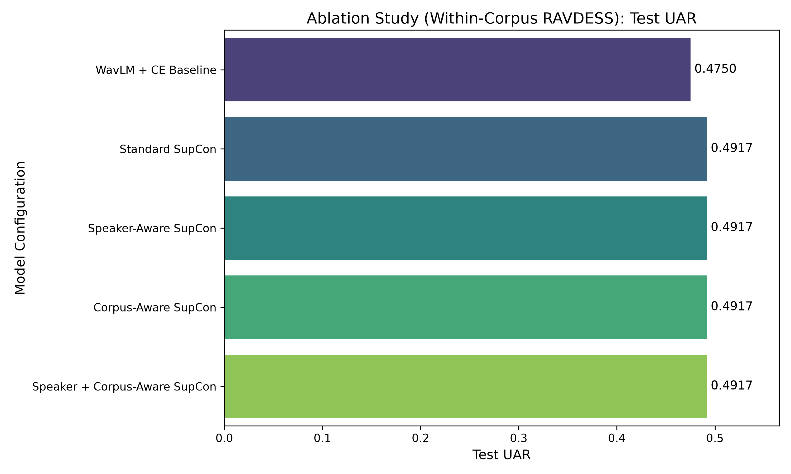
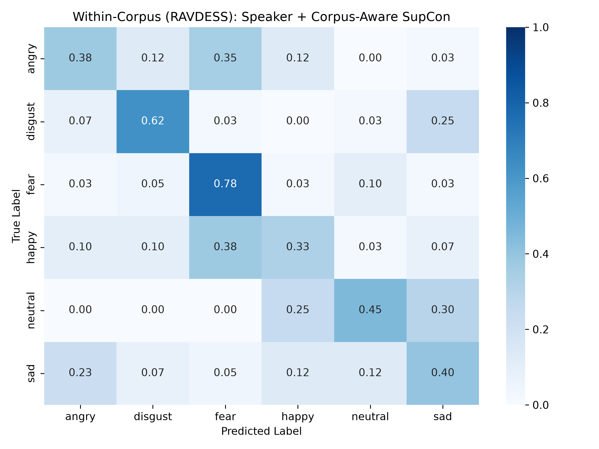
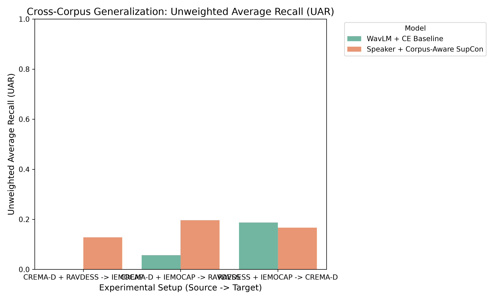

# Speech Emotion Recognition (SER)

This project explores the capability of machine learning models to detect human emotions from voice using pre-trained audio representations.

## Project Overview

The system utilizes a frozen **WavLM-base** model as the primary backbone, trained to recognize 6 basic emotions:
* Angry
* Disgust
* Fear
* Happy
* Neutral
* Sad

The model is trained on a combined dataset comprising three standard speech emotion corpora (CREMA-D, RAVDESS, and IEMOCAP), resulting in over 18,000 audio samples. To optimize performance, a standard Cross-Entropy loss is combined with Supervised Contrastive Learning (SupCon).

## Results

When evaluated on a held-out, in-domain test set, the model achieved an **Unweighted Accuracy Rate (UAR) of 58.94%**. All contrastive learning variants—including proposed speaker- and corpus-aware versions—performed equally well, matching the standard SupCon baseline.

The following confusion matrix illustrates the model's performance across the different emotion classes:

### Error Analysis
While the model achieves strong baseline performance, specific misclassifications occur:
- **Angry vs. Happy:** Due to similar high arousal characteristics, the model occasionally misclassifies these emotions.
- **Neutral vs. Sad:** These low arousal emotions tend to exhibit similar acoustic properties, leading to confusion.

### Cross-Corpus Performance
Zero-shot cross-corpus evaluation was conducted to assess model performance in unseen environments. Accuracy decreases when the model is evaluated on entirely different datasets. This drop is particularly evident with IEMOCAP, which features conversational speech compared to the acted, isolated sentences found in CREMA-D and RAVDESS.

